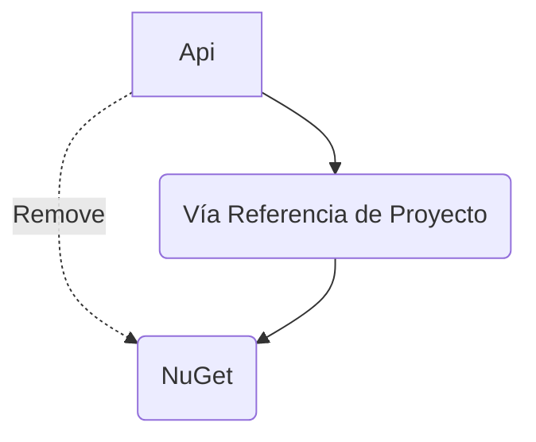

# Especificación Técnica

## Tipo de Tarea
Feature / Bug-Fix (Corrección de Auditoría)

## Funcionalidad
Desacoplar la referencia del paquete NuGet `Microsoft.EntityFrameworkCore.Design` en `src/GesFer.Admin.Back.Api/GesFer.Admin.Back.Api.csproj`.

## Entidades Afectadas
Ninguna. Solo proyectos del archivo de solución.

## Diagrama de Interacción

